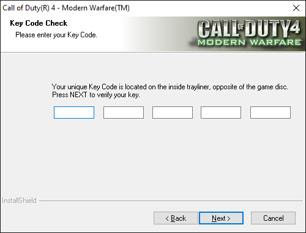
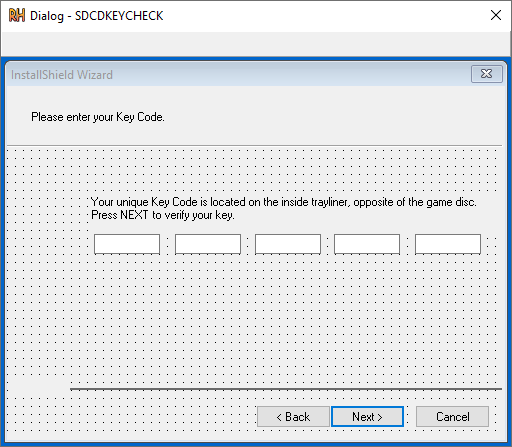

# COD 4

## Recon

COD uses `InstallShield` to package and manage this installation of the game.

Running through the process gives us a window like so:



Looking at the resources of `setup.exe` does not show us any sign that the logic is contain within.

Using process hacker we can see that the `setup.exe` spawns a child process.

<!-- <TODO: Image here> -->

We can navigate to the file location where `setup.exe` unpacked all the resources.

We see something like so:


These are all the assets and `.dlls` used in the installation process!

After a bit of trial and error the file: `_isuser.dll` contains the dialog we're after!



However no strings? Even when `grep`ing for them?

## InstallerShield

After doing some research it became apparent that the key verification logic will be handled by an internal "InstallerShield" script.

Within our directory of files we found earlier is a `setup.inx`, this is a compiled InstallShield script and will most likely contain the key verification logic.

Using the work of others it is possible to get somewhat readable code from this file.

The decompiler user was [SID](https://github.com/tylerapplebaum/setupinxhacking), this lets us view the reversed code!

But before we do that the `Setup.inx` requires decryption, the same author also provides a decryption script.

The code is displayed below:

```c
#include <stdio.h>
#include <fcntl.h>
#include <io.h>
#define XOR_VAL 0xF1

void main (void) 
{
  int i, c;
  unsigned char b;
  // Set "stdin" and "stdout" to have binary mode
  setmode (_fileno (stdin), _O_BINARY);
  setmode (_fileno (stdout), _O_BINARY);
  // Decrypt INX
  for (i = 0; (c = getchar ()) != EOF; i++) 
  {
    c ^= XOR_VAL;
    b = (unsigned char)((c >> 2) | (c << 6)) - (i % 71);
    putchar (b);
  }
}
```

This then lets us chuck the 'decrypted' `.inx` file into `SID`. The file can be found in the RE files under `Setup_dec.inx` and the code in `Setup.rul`

## Setup.inx

Could of key elements to note:

- Function called `CDKeyCheck`

`global_string4`
```
function_664(local_string3, "InstallDrive", 1, global_string4, local_number2);
```

`CDKeyCheck`
```
function BOOL CDKeyCheck(local_string1, local_string2)
           NUMBER local_number1, local_number2, local_number3; 
           STRING local_string3; 

    begin
       function_373(-2);
       local_number1 = LASTRESULT;
       local_string3 = (global_string4 ^ "Setup\\rsrc");
       function_517(local_string3);
       UseDll(local_string1);
       local_number3 = LASTRESULT;
       local_number3 = (local_number3 < 0);
       if(local_number3) then // ref index: 1
          local_string3 = (local_string1 + " failed to load!");
          function_632(local_string3, -65534);
          // return coming
          return 0;
          goto label_100b7;
       endif;
    label_ffe3:
       GetCDKey(local_number1, local_string2); // dll: CHECK.dll
       local_number2 = LASTRESULT;
       local_number3 = (local_number2 = 0);
       if(local_number3) then // ref index: 1
          function_605("USERDEF_INVALID_CD_KEY");
          local_string3 = LASTRESULT;
          function_632(local_string3, -65533);
          abort;
       endif;
    label_10051:
       UnUseDll(local_string1);
       local_number3 = LASTRESULT;
       local_number3 = (local_number3 < 0);
       if(local_number3) then // ref index: 1
          local_string3 = (local_string1 + " failed to load!");
          function_632(local_string3, -65534);
          // return coming
          return 0;
       endif;
    label_100b7:
       // return coming
       return local_number2;
    end; // checksum: 71a4093c
```


`ValidateCDKey`
```
function BOOL ValidateCDKey(local_string1)
      NUMBER local_number1, local_number2, local_number3, local_number4, local_number5, local_number6, local_number7, local_number8; 
   begin
      StrLength(local_string1);
      local_number2 = LASTRESULT;
      local_number6 = (local_number2 != 20);
      if(local_number6) then // ref index: 1
         // return coming
         return 0;
      endif;
   label_102ee:
      local_number4 = 16;
      local_number3 = 0;
      local_number6 = (local_number4 - 1);
   label_10317:
      local_number7 = (local_number3 <= local_number6);
      if(local_number7) then // ref index: 20
         local_number1 = local_string1[local_number3];
         local_number7 = (local_number1 >= 97);
         local_number8 = (local_number1 <= 65);
         local_number7 = (local_number7 = local_number8);
         if(local_number7) then // ref index: 1
            local_number1 = (local_number1 - 32);
         endif;
   label_10385:
         // switch/while/???
   label_1038b:
         local_number7 = (local_number1 = 50);
         if(local_number7) then // ref index: 1
            local_number5 = 1;
            goto label_106ba;
         endif;
   label_103bd:
         local_number7 = (local_number1 = 52);
         if(local_number7) then // ref index: 1
            local_number5 = 1;
            goto label_106ba;
         endif;
   label_103ef:
         local_number7 = (local_number1 = 56);
         if(local_number7) then // ref index: 1
            local_number5 = 1;
            goto label_106ba;
         endif;
   label_10421:
         local_number7 = (local_number1 = 68);
         if(local_number7) then // ref index: 1
            local_number5 = 1;
            goto label_106ba;
         endif;
   label_10453:
         local_number7 = (local_number1 = 69);
         if(local_number7) then // ref index: 1
            local_number5 = 1;
            goto label_106ba;
         endif;
   label_10485:
         local_number7 = (local_number1 = 71);
         if(local_number7) then // ref index: 1
            local_number5 = 1;
            goto label_106ba;
         endif;
   label_104b7:
         local_number7 = (local_number1 = 74);
         if(local_number7) then // ref index: 1
            local_number5 = 1;
            goto label_106ba;
         endif;
   label_104e9:
         local_number7 = (local_number1 = 76);
         if(local_number7) then // ref index: 1
            local_number5 = 1;
            goto label_106ba;
         endif;
   label_1051b:
         local_number7 = (local_number1 = 77);
         if(local_number7) then // ref index: 1
            local_number5 = 1;
            goto label_106ba;
         endif;
   label_1054d:
         local_number7 = (local_number1 = 80);
         if(local_number7) then // ref index: 1
            local_number5 = 1;
            goto label_106ba;
         endif;
   label_1057f:
         local_number7 = (local_number1 = 81);
         if(local_number7) then // ref index: 1
            local_number5 = 1;
            goto label_106ba;
         endif;
   label_105b1:
         local_number7 = (local_number1 = 83);
         if(local_number7) then // ref index: 1
            local_number5 = 1;
            goto label_106ba;
         endif;
   label_105e3:
         local_number7 = (local_number1 = 84);
         if(local_number7) then // ref index: 1
            local_number5 = 1;
            goto label_106ba;
         endif;
   label_10615:
         local_number7 = (local_number1 = 85);
         if(local_number7) then // ref index: 1
            local_number5 = 1;
            goto label_106ba;
         endif;
   label_10647:
         local_number7 = (local_number1 = 87);
         if(local_number7) then // ref index: 1
            local_number5 = 1;
            goto label_106ba;
         endif;
   label_10679:
         local_number7 = (local_number1 = 89);
         if(local_number7) then // ref index: 1
            local_number5 = 1;
            goto label_106ba;
         endif;
   label_106ab:
         // return coming
         return 0;
   label_106ba:
         local_number3 = (local_number3 + 1);
         goto label_10317;
      endif;
   label_106d4:
      // return coming
      return local_number5;
   end; // checksum: fffca0d6
```

`VerifyCDKey5`
```
function BOOL VerifyCDKey5(local_string1, local_string2, local_string3, local_string4, local_string5)

STRING local_string9; 

begin
   local_string9 = (local_string1 + local_string2);
   local_string9 = (local_string9 + local_string3);
   local_string9 = (local_string9 + local_string4);
   local_string9 = (local_string9 + local_string5);
   VerifyCDKey(local_string9);
   return;
end; // checksum: 2c4d317b
```

`VerifyCDKey`
```
function BOOL VerifyCDKey(local_string1)
   NUMBER local_number1, local_number2, local_number3, local_number4, local_number5; 
   STRING local_string2, local_string3, local_string4; 

begin
   local_number1 = 0;
   local_number2 = 0;
   local_string2 = local_string1;
   GetCRC(local_string2);
   local_number4 = LASTRESULT;
   function_815(local_string4, "%4x", local_number4);
   local_number3 = 0;
label_107a3:
   local_number4 = (local_number3 <= 4);
   if(local_number4) then // ref index: 2
      local_number4 = local_string4[local_number3];
      local_number4 = (local_number4 = 32);
      if(local_number4) then // ref index: 1
         local_string4[local_number3] = 48;
      endif;
label_107f7:
      local_number4 = local_string4[local_number3];
      local_string3[local_number3] = local_number4;
      local_number3 = (local_number3 + 1);
      goto label_107a3;
   endif;
label_1082b:
   local_string3[local_number3] = 0;
   function_811(local_string3, local_string3);
   local_number3 = 0;
label_10854:
   local_number4 = (local_number3 <= 4);
   if(local_number4) then // ref index: 2
      local_number4 = local_string3[local_number3];
      local_number5 = (16 + local_number3);
      local_number5 = local_string2[local_number5];
      local_number4 = (local_number4 != local_number5);
      if(local_number4) then // ref index: 1
         local_number2 = 1;
      endif;
label_108bf:
      local_number3 = (local_number3 + 1);
      goto label_10854;
   endif;
label_108d9:
   ValidateCDKey(local_string2);
   local_number4 = LASTRESULT;
   local_number5 = (local_number2 != 1);
   local_number4 = (local_number4 = local_number5);
   if(local_number4) then // ref index: 1
      // return coming
      return 1;
      goto label_1093b;
   endif;
label_1092c:
   // return coming
   return 0;
label_1093b:
end; // checksum: f20ee05
```